# Assignment 1 - Task-3

### create docker volume
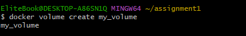

### create container using image and mount vol
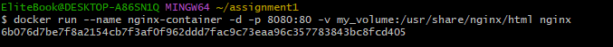

### "nginx" default page is accessible on your host machine at http://localhost:8080.
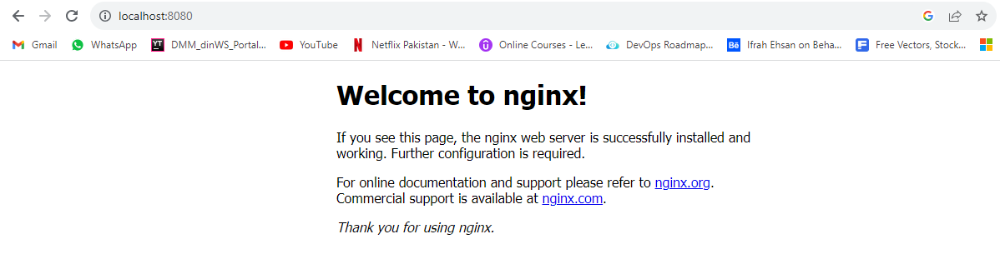

### create html file
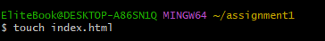

### copy index.html file to volume
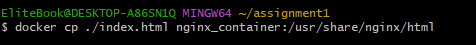

### http://localhost:8080/index.html.
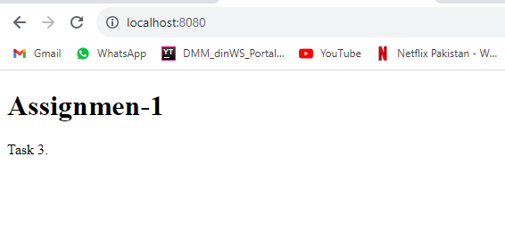

### stop and remove container
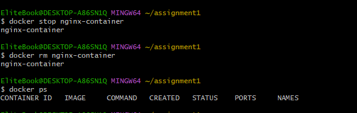

### new Docker container using the "httpd" image
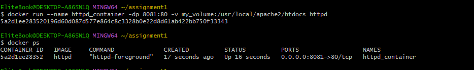

### create about.html file
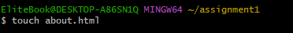

### copy about.html file to volume
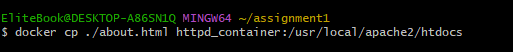

### http://localhost:8081/about.html.
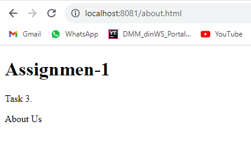

### stop and remove container
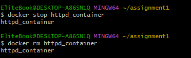

### Verify Files
i have run inspect command to verify it
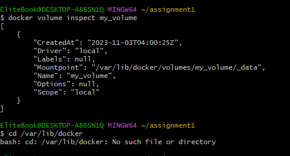
but you can only verify files using command in linux, in mac and windows either you create new container to verify or use docker desktop to verify it.
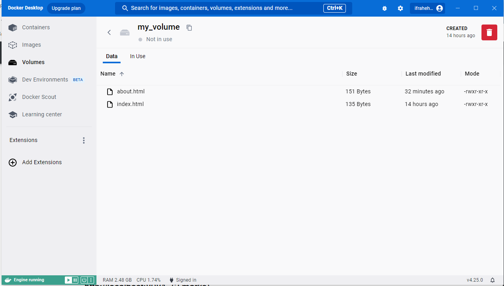

### Remove Volume
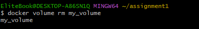
